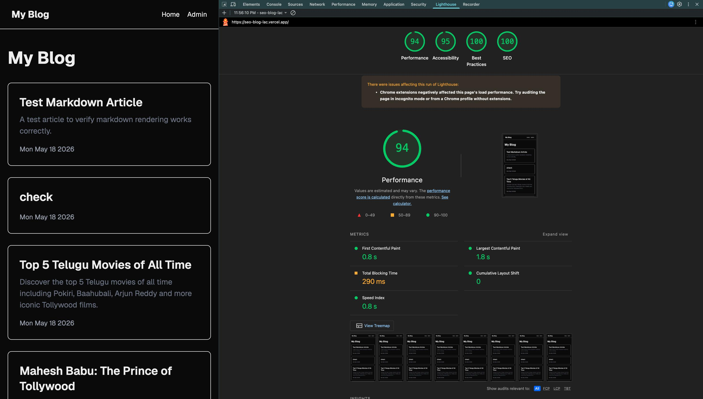
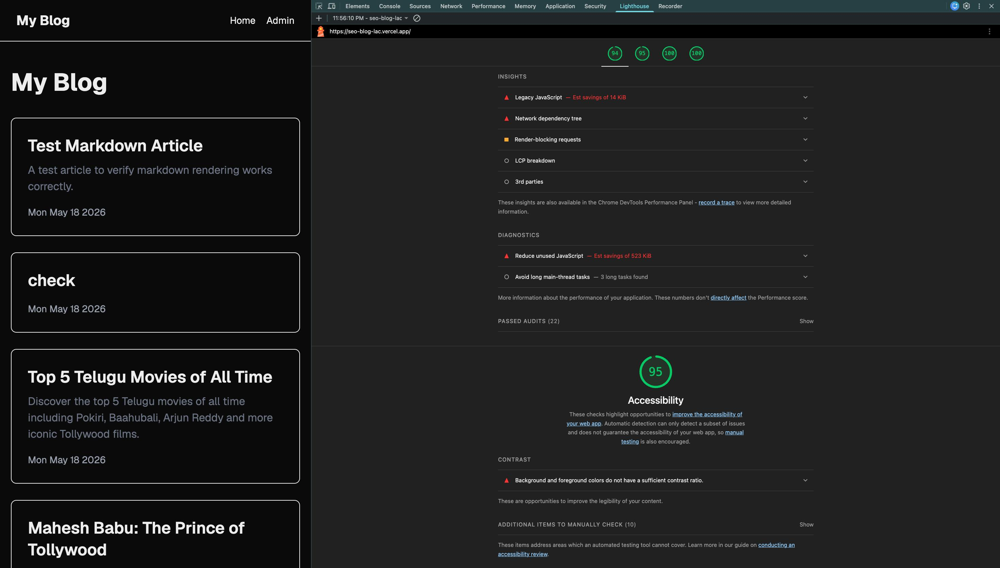
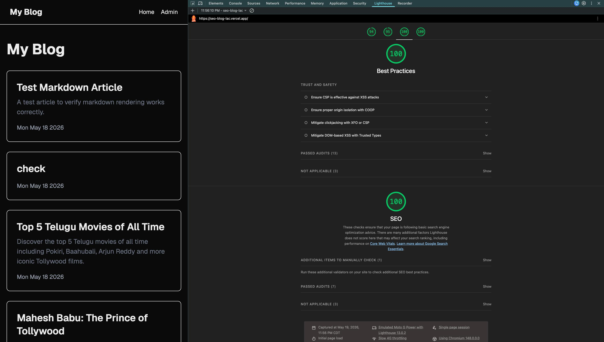

# SEO-Optimised Blog CMS

A full-stack blog platform built with **Next.js 16**, **Supabase**, and **Tailwind CSS**. Admins can create, edit, and publish articles through a protected admin panel. The public site is optimised for SEO and performance.

🌐 **Live Site:** [seo-blog-lac.vercel.app](https://seo-blog-lac.vercel.app)  
📂 **GitHub:** [github.com/bhavyukthadacharla/seo-blog](https://github.com/bhavyukthadacharla/seo-blog)

---

## Features

### Admin Panel
- Create, edit, delete articles
- Rich text editor (Tiptap) with bold, italic, headings, lists, blockquote
- Image upload via Supabase Storage
- Publish / unpublish toggle
- Auto-generated URL slug from title
- Password-protected via middleware and cookie

### Public Site
- Article listing page with title, description, and date
- Individual article pages with reading time
- Semantic HTML (`<article>`, `<header>`, `<footer>`, `<time>`)
- Fully responsive layout

### SEO
- Per-article `<title>` and `<meta description>`
- Open Graph and Twitter Card tags
- JSON-LD structured data (`Article` schema)
- Auto-generated `sitemap.xml`
- Proper heading hierarchy (H1 → H2 → H3)

### Performance
- Static generation via `generateStaticParams`
- `next/image` with lazy loading, WebP conversion, and responsive sizes
- Google Fonts optimised via `next/font`

---

## Tech Stack

| Layer | Technology |
|---|---|
| Framework | Next.js 16 (App Router) |
| Database | Supabase (PostgreSQL) |
| Storage | Supabase Storage |
| Styling | Tailwind CSS v4 |
| Editor | Tiptap |
| Deployment | Vercel |

---

## Getting Started

### 1. Clone the repo

```bash
git clone https://github.com/bhavyukthadacharla/seo-blog.git
cd seo-blog
```

### 2. Install dependencies

```bash
npm install
```

### 3. Set up environment variables

Create a `.env.local` file in the root:

```env
NEXT_PUBLIC_SUPABASE_URL=your_supabase_project_url
NEXT_PUBLIC_SUPABASE_ANON_KEY=your_supabase_anon_key
NEXT_PUBLIC_SITE_URL=https://seo-blog-lac.vercel.app
NEXT_PUBLIC_ADMIN_PASSWORD=your_admin_password
```

### 4. Set up Supabase

Create an `articles` table with the following columns:

| Column | Type |
|---|---|
| id | uuid (primary key) |
| title | text |
| slug | text |
| content | text |
| meta_description | text |
| image_url | text |
| published | boolean (default: false) |
| created_at | timestamptz (default: now()) |
| updated_at | timestamptz |

Also create a Supabase Storage bucket named `images` with public access.

### 5. Run the development server

```bash
npm run dev
```

Open [http://localhost:3000](http://localhost:3000) to view the public site.  
Go to [http://localhost:3000/admin/login](http://localhost:3000/admin/login) to access the admin panel.

---

## Deployment

Deployed on **Vercel**. Add the same environment variables from `.env.local` in your Vercel project settings.

---

## Lighthouse Score





---

## Project Structure

app/
page.js                  → Public homepage (article listing)
layout.js                → Root layout with navbar and footer
sitemap.js               → Auto-generated sitemap
articles/[slug]/page.js  → Individual article page
admin/page.js            → Admin dashboard (protected)
admin/login/page.js      → Admin login
components/
RichTextEditor.js        → Tiptap rich text editor
lib/
supabase.js              → Supabase client
middleware.js              → Protects /admin routes